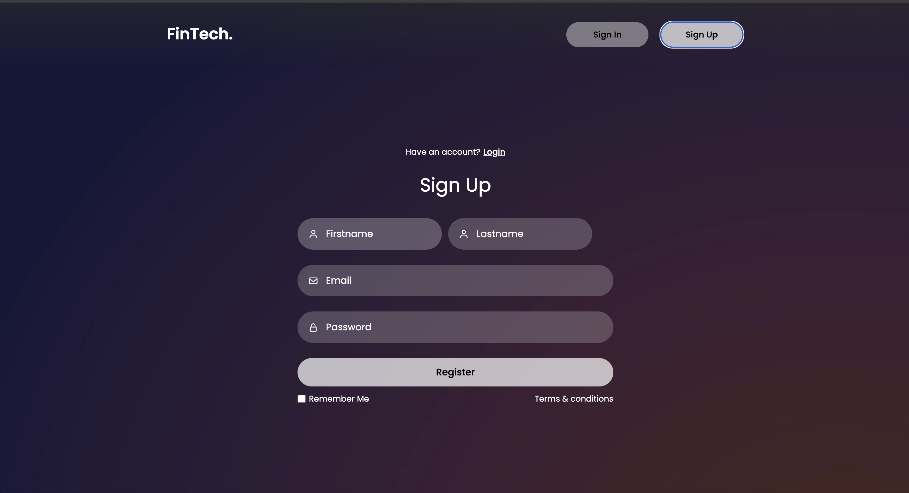

# FinanceTracker Application

FinanceTracker is a web-based application designed to help users manage their income, expenses, and budgets. The application offers features like income and expense tracking, report generation, and budget management, all while providing a simple and user-friendly interface.

## Key Features

### 1. User Authentication
- **Sign up**: New users can create an account by providing their first name, last name, email, and password.

- **Login/Logout**: Existing users can log in to access their dashboard, and they can log out anytime.

- **Profile Management**: Users can view and update their profile details, including their first name, last name, and email.

### 2. Dashboard Overview

- **Account Balance**: View your current account balance based on your income and expenses.
- **Expenses by Category**: Visual representation of expenses grouped by categories.
- **Income/Expense Trends**: Track income and expenses over the last 10 days, with graphical data displayed on the dashboard.
  
### 3. Income Management
- **Add Income**: Users can add new income records by specifying the name, category, amount, date, and notes.
- **Edit Income**: Edit existing income records, with automatic adjustment of the user's account balance based on the changes made.
- **Delete Income**: Users can delete any income record, and the account balance is adjusted accordingly.

### 4. Expense Management
- **Add Expense**: Add expenses by specifying the name, category, amount, date, and notes. 
- **Edit Expense**: Users can edit any existing expense record. The account balance is updated based on the changes made.
- **Delete Expense**: Expenses can be deleted, and the account balance is automatically updated.
  
### 5. Category Management
- **Add/Remove Categories**: Users can create and delete their custom income and expense categories, allowing for flexible categorization of their finances.
  
### 6. Report Generation
- **Expense Report**: Generate CSV reports for expenses filtered by daily, weekly, monthly, or all-time duration.
- **Income Report**: Generate CSV reports for incomes filtered by daily, weekly, monthly, or all-time duration.

### 7. Settings
- **Profile Updates**: Users can update their profile information (first name, last name, and email).
- **Category Management**: Manage income and expense categories from the settings page.

## Installation

1. Clone the repository:
    ```bash
    git clone https://github.com/abbasikov/finance-tracker.git
    ```
2. Navigate to the project directory:
    ```bash
    cd finance-tracker
    ```
3. Install the required dependencies:
    ```bash
    pip install -r requirements.txt
    ```
4. Run migrations:
    ```bash
    python manage.py migrate
    ```
5. Start the Django development server:
    ```bash
    python manage.py runserver
    ```

## Usage

- Access the application by navigating to `http://localhost:8000/` in your web browser.
- Create a new account or log in using an existing account.
- Use the dashboard to view financial summaries and trends.
- Add, edit, or delete income and expenses from the respective pages.
- Manage your categories and generate financial reports.

## Contributing

Feel free to submit issues or pull requests for new features, bug fixes, or general improvements.

---